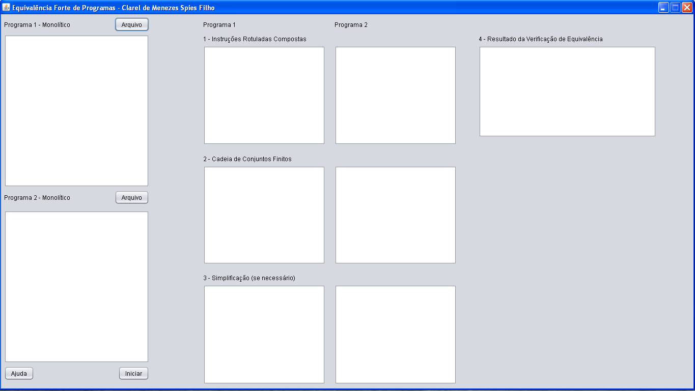

# Equivalencia De Programas
Repositório de programa usado para verificar a equivalência forte de programas em formato monolíticos, trabalho realizado para a disciplina de Teoria da Computação na UNISC 2016/2.

1 - Importar como maven Project.  
2 - No Eclipse, exportar como runnable jar file e selecionar para incluir dependencias. (Netbeans não está exportando corretamente).  
Documentos necessários para realizar testes e o enunciado do trabalho estão em /docs.

## Imagem da aplicação

## Instruções:
Para o funcionamento correto do programa, espera entradas em formato de programa monolítico nos seguintes formatos:

* FACA G VA-PARA 5 (OPERAÇÕES)
* SE T1 VA-PARA 2 SENAO-VA-PARA 1 (TESTE)
